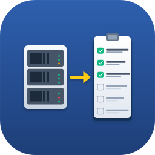

<p align="center">
  
</p>

# XOInventory

A macOS SwiftUI app that inventories VMs and hosts on an XCP-NG cluster via
the [Xen Orchestra REST API](https://docs.xen-orchestra.com/restapi).

## Features

- **Multiple host profiles** — save as many XO instances as you like and
  switch between them. Tokens live in the macOS Keychain, metadata in
  `UserDefaults`.
- **Test Connection** button in the profile editor, with green check or red
  X and a live VM / host count.
- **Hosts tab** — table of hypervisors with name, address, CPU model + count,
  memory usage with inline bar, resident VM count, and version. Detail pane
  on the right.
- **VMs tab** — sortable, searchable table with name, power state, IP,
  vCPUs, memory, disk, OS. Detail pane on the right.
- **Per-host filter** on the VMs tab — narrow the list to VMs running on a
  single hypervisor, or view all.
- **CSV and PDF export** — "Export" menu in the toolbar. PDF is a paginated
  landscape report with summary strip and zebra-striped table; respects the
  current host filter.
- **Switch Host** returns to the profile picker without quitting the app.

## Requirements

- macOS 13+
- Xcode 15+
- An XO instance with an account that has admin rights — the REST API is
  admin-only today.

## Profile and token storage

Host profiles (name, hostname/IP, self-signed toggle) are persisted in
`UserDefaults`. Tokens live in the **macOS Keychain** under the service
`com.camerongary.XOInventory.token`, keyed by each profile's UUID.

Deleting a profile removes its Keychain entry.

## Getting an auth token

From the XO web UI: user menu → **Authentication tokens** → create one.

Or from the CLI:

```sh
xo-cli create-token xo.your.lan admin@your.tld
```

## Build & run

```sh
open XOInventory.xcodeproj
```

Hit ⌘R. On first launch you'll also want to pick your own Team and bundle
identifier under Signing & Capabilities. The project ships with
`com.camerongary.XOInventory` — if you change it after saving profiles, the
new bundle can't read the old Keychain items and you'll need to re-enter
tokens.

## Project layout

```
XOInventory/
├── XOInventoryApp.swift        — @main entry
├── ContentView.swift           — routes between picker and inventory
├── ConnectionView.swift        — saved profile picker
├── ProfileEditorView.swift     — add/edit profile with Test Connection
├── HostProfile.swift           — profile model + ProfileStore
├── Keychain.swift              — SecItem wrapper for token storage
├── InventoryView.swift         — tab switcher, toolbar, exports
├── HostsView.swift             — Hosts tab (table + detail)
├── VMDetailView.swift          — VM detail pane
├── InventoryViewModel.swift    — @MainActor state, filter, disk rollup
├── XOClient.swift              — actor-based REST client
├── PDFReport.swift             — Core Graphics PDF builder
└── Models.swift                — VM, Host, VDI, XOConnection
```

## REST endpoints used

- `GET /rest/v0/` — probe
- `GET /rest/v0/vms?fields=...` — full VM inventory
- `GET /rest/v0/vms/{uuid}/vdis?fields=...` — disk size rollup
- `GET /rest/v0/hosts?fields=...` — hosts / hypervisors

Authentication: `Cookie: authenticationToken=<token>`

## Known limitations

- Disk size uses VDI `size` (provisioned), not actual SR usage.
- IP detection relies on XAPI guest tools being installed in each VM.
- Keychain items are scoped to the app's bundle ID. Change the bundle ID
  and you'll need to re-enter tokens.
